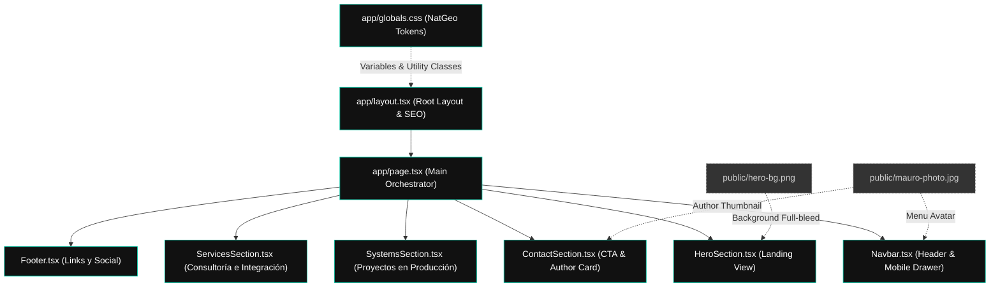

# Contexto del Proyecto: Portafolio Mauro.Dev

Este documento sirve como referencia de contexto sobre la arquitectura, diseño y decisiones técnicas tomadas durante la construcción del portafolio.

## 1. Stack Tecnológico
- **Framework:** Next.js 14 (App Router)
- **Lenguaje:** TypeScript
- **Estilos:** Tailwind CSS + CSS Modules/Variables Globales
- **Animaciones:** Framer Motion
- **Iconos:** Lucide React

## 2. Decisiones de Diseño (NatGeo Style)
El diseño está inspirado fuertemente en el estilo editorial/arquitectónico premium similar a los interactivos de National Geographic.
- **Paleta de Colores:** Alternancia estricta entre secciones oscuras (`#000000`, `--black`) y claras (`#FFFFFF`, `--white`), con un solo color de acento dorado/teal (`#00c9a7`, `--gold`).
- **Tipografía:** Uso de tipografías muy grandes, en negrita (`font-black`), interlineado cerrado (`leading-[0.9]`), y en mayúsculas para los títulos (`display`, `section-title`). Uso de tipografía monoespaciada pequeña (`eyebrow`) para etiquetas e indicadores.
- **UI Components:** 
  - Botones "fantasma" (Ghost buttons) con esquinas cuadradas (`border-radius: 0`).
  - Líneas finas (hairlines) divisorias para estructurar contenido.
  - Indicador de progreso de lectura (barra superior dorada).
  - Efectos sutiles en las imágenes (grayscale con overlays de color en hover).
- **Mobile First:** Diseño optimizado para pantallas pequeñas (390px), ocultando o colapsando elementos inteligentemente (ej. menú a pantalla completa, 100svh en el hero).

## 3. Arquitectura y Componentes (Mapa UML)

El siguiente mapa UML (en formato Mermaid) ilustra cómo se estructura la aplicación. `page.tsx` actúa como el orquestador principal que ensambla las distintas secciones, todas diseñadas como Server Components o Client Components de forma modular.

## 4. Archivos Clave
- `src/app/globals.css`: Contiene todos los "Design Tokens" (variables CSS, clases globales como `.display`, `.eyebrow`, `.btn-ng`, `.section-dark`, `.section-white`). Si necesitas cambiar un color global, hazlo aquí.
- `src/components/*`: Todos los componentes son marcados con `"use client"` ya que hacen uso de interactividad de estado (`useState`, `useEffect`) y animaciones de entrada (`framer-motion`).
